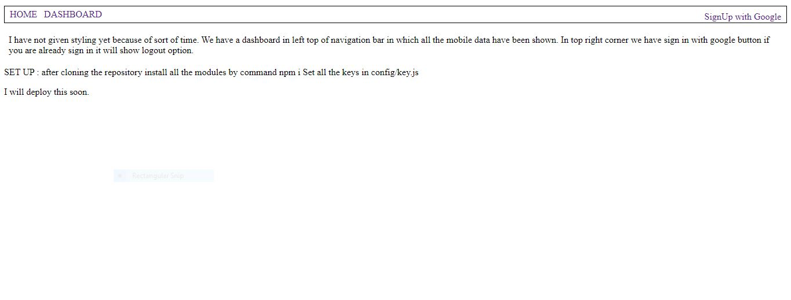
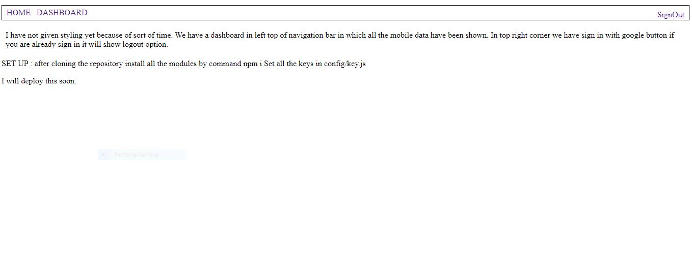
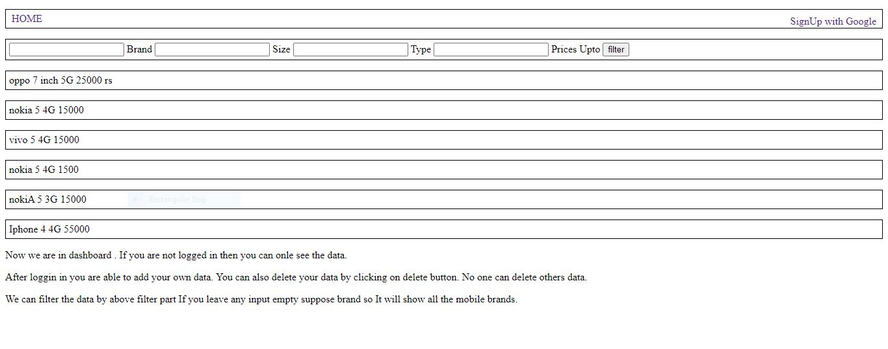
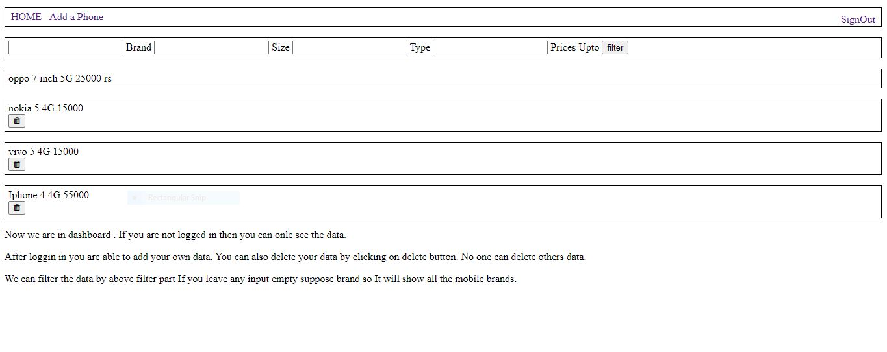

<h2 style="color:#986f59;">Screenshots of Project </h2>

<h4> HOME WITHOUT SIGN IN </h4>

<h4>HOME WITH SIGN IN </h4>

<h4>DASHBOARD WITHOUT SIGN IN </h4>

<h4>DASHBOARD WITH SIGNIN </h4>

<h4>ADD SMARTPHONE FEATURES PAGE ( SIGN IN REQUIRED ) </h4>

